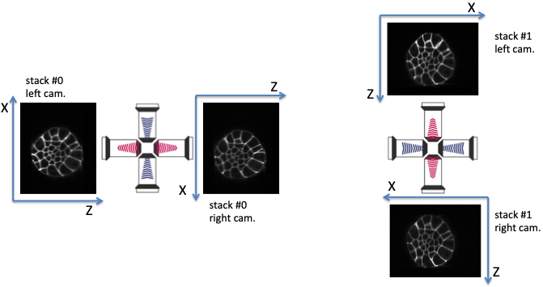
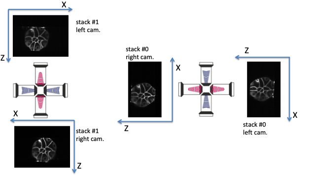
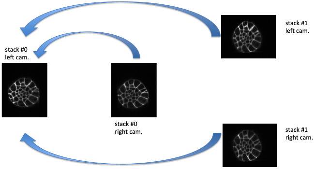
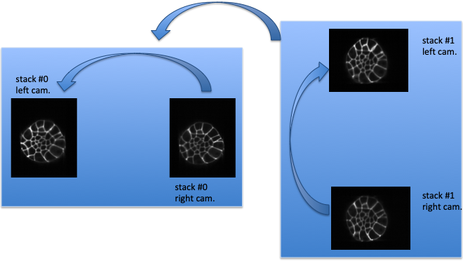
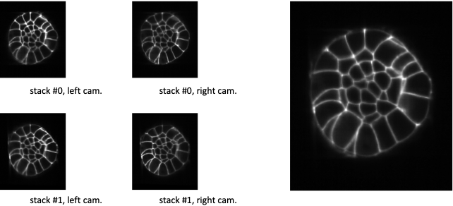
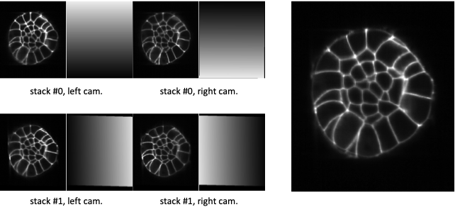
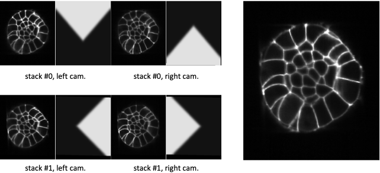
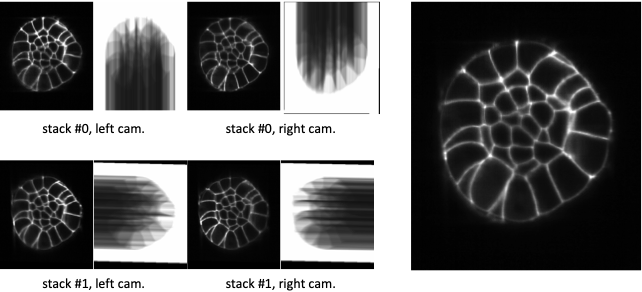

.. role:: python(code)
   :language: python

``astec_fuse``
==============

.. _cli-fuse-overview:

Fusion method overview
----------------------

The fusion is made of the following steps.

1. Optionally, a slit line correction. Some Y lines may appear brighter in the acquisition and causes artifacts in the reconstructed (i.e. fused) image. By default, it is not done.

2. A change of resolution in the X and Y directions only (Z remains unchanged). It allows to decrease the data volume (and then the computational cost) if the new pixel size (set by ``target_resolution``) is larger than the acquisition one.

3. Optionally, a crop of the resampled acquisitions. It allows to decrease the volume of data, hence the computational cost. The crop is based on the analysis of a MIP view (in the Z direction) of  the volume, and thus is sensitive to hyper-intensities if any. By default, it is done.

4. Optionally, a mirroring of the images:
   
   * if the :python:`acquisition_mirrors` variable is set to :python:`False`, a mirroring along the X axis of the *right camera* images (see also section :ref:`cli-fuse-important-parameters`), and
   * if the ``acquisition_leftcamera_z_stacking`` variable is set to ``'inverse'``, a mirroring along the Z axis of both *left camera* and *right camera* images (see also section :ref:`cli-fuse-important-parameters`).

5. Co-registration of the 3 last images onto the first one (the acquisition from the left camera for stack #0) considered as a reference. The reference image is resampled again, to get an isotropic voxel (whose size is given by ``target_resolution``), i.e. the voxel size is the same along the 3 directions: X, Y, Z. There are two alternative methods.
   
   1. The direct fusion method. Each of the  3 last images is *linearly* co-registered onto the reference image.
   2. The hierarchical method. Each stack is first reconstructed (with the acquisition couple of both left and right cameras), then stack #1 is *non-linearly* co-registered onto stack #0. From this last registration, non-linear co-registrations are deduced for the stack #1 acquisitions, while linear co-registration is still considered for the right camera acquisition of stack #0.

6. Weighted linear combination of images.

7. Optionally, a crop of the fused image, still based on the analysis of a MIP view (in the Z direction). By default, it is done.

.. _acquisition-spim-right:

   Multiview lightsheet microscope acquisition ('right' acquisition).

   Multiview lightsheet microscope acquisition: at a time point, two acquisitions (stack #0 and stack #1) are sequentially performed, the second one orthogonal to the first. For each acquisition, two 3D intensity image stacks are acquired, respectively by the left and the right cameras. It yields four image stacks to be fused. The frame (X,Z) of the left camera of stack #0 needs to be rotated clockwise (90 degrees along the Y axis) to correspond to the frame of the left camera of stack #1: ``acquisition_orientation`` has to be set to ``'right'`` if ``acquisition_leftcamera_z_stacking`` is set to ``'direct'``.

.. _acquisition-spim-left:

   Multiview lightsheet microscope acquisition ('left' acquisition).
   
   The frame (X,Z) of the left camera of stack #0 needs to be rotated counterclockwise (-90 degrees along the Y axis) to correspond to the frame of the left camera of stack #1: ``acquisition_orientation`` has to be set to ``'left'`` if ``acquisition_leftcamera_z_stacking`` is set to ``'direct'``.

.. _cli-fuse-important-parameters:

Important parameters in the parameter file
------------------------------------------

A simple parameter file for fusion is described in the 
`tutorial section <https://astec.gitlabpages.inria.fr/astec-tutorial/astec_tutorial.html#fusion>`_. 
An exhaustive presentation of all parameters can be found in section :ref:`cli-parameters-fuse`.

Indicating the right values of the
acquisition parameters is crucial; these parameters are

* ``acquisition_mirrors``  (or ``raw_mirrors``) is a parameter indicating whether the right camera images have already been mirrored along the X axis (so that the X axis direction is the one of the left cameras) or not. Its value is either ``False`` or ``True``. Such a parameter should depend on the acquisition apparatus (ie the microscope) and the should be identical for all acquisitions.

   In acquisitions depicted in figures :ref:`acquisition-spim-right` and :ref:`acquisition-spim-left`, it can be seen that the X-axis of the right camera image is inverted with respect to the left camera image. ``acquisition_mirrors`` has to be set to ``False``.
  
* ``acquisition_orientation`` (or ``raw_ori``) is a parameter describing the acquisition orientation of the acquisition of the stack #1 images with respect to the stack #0 ones. 

   * ``'right'`` : the frame (X, Z) of the left camera of stack #0 needs to be rotated clockwise (90 degrees along the Y axis) to correspond to the left camera of stack #1 (see figure :ref:`acquisition-spim-right`).
   * ``'left'``: the frame (X, Z) of the left camera of stack #0 needs to be rotated counterclockwise (-90 degrees along the Y axis) to correspond to the left camera of stack #1 (see figure :ref:`acquisition-spim-left`).

* ``acquisition_leftcamera_z_stacking`` gives the order of stacking of in the Z direction for the left camera images.

   * ``'direct'``: *z* increases from the high-contrasted images to the blurred ones  (see figure :ref:`acquisition-spim-right`).
   * ``'inverse'``: *z* increases from the blurred images to the high-contrasted ones (see figure :ref:`acquisition-spim-left`).
     
   Looking at XZ-sections of the registered images (see figures :ref:`fusion-uniform-combination`, :ref:`fusion-ramp-combination`, :ref:`fusion-corner-combination`, and :ref:`fusion-guignard-combination`) provides an efficient means to check whether this parameter is correctly set (see also section :ref:`cli-fuse-linear-combination`).

* ``acquisition_resolution`` (or ``raw_resolution}`` is the voxel size (along the 3
    dimensions X, Y and Z) of the acquired images.

* ``target_resolution`` is the desired isotropic (the
    same along the 3 dimensions) voxel size for the result fusion
    images.

* ``begin`` gives the index of the first time point to be
  processed.

* ``end`` gives the index of the last time point to be processed.

When one may not be sure of the ``raw_ori``, ``raw_mirrors``, and  ``acquisition_leftcamera_z_stacking`` right values, it is advised to perform the
fusion on only one time point (by indicating the same index for both
``begin``  and ``end``), e.g. with the four possibilities for the
variable couple (``raw_ori``, ``raw_mirrors``), i.e. (``'left'``, ``False``),
(``'left'``, ``True``), (``'right'``, ``False``), and (``'right'``, ``True``).
It comes to write four parameter files that differ only for the
parameters ``raw_ori``, ``raw_mirrors``, and ``EXP_FUSE``  (to store the fusion result in different directories, see section :ref:`cli-fuse-output-data`).
For these first experiments, it is advised 

* to set ``target_resolution`` to a large value, in order to speed up
  the calculations, and

* to set  ``fusion_xzsection_extraction`` to ``True``, in order to check whether ``acquisition_leftcamera_z_stacking`` was correctly set (see also section :ref:`cli-fuse-linear-combination`).

Please recall that ``raw_ori`` should depend on the acquisition apparatus (ie the microscope), and should not change for all the other acquisitions on the same microscope (unless the microscope settings change). Then, for most experiments, one change only to test the value of 
``raw_ori``.

Please note that changing the value of ``acquisition_leftcamera_z_stacking`` implies to change also the value of ``acquisition_orientation``.

.. _cli-fuse-input-data:

Fusion / input data
-------------------

Input data (acquired images from the MuViSPIM microscope, see figures :ref:`acquisition-spim-right` and :ref:`acquisition-spim-left`) are assumed
to be organized in a separate ``RAWDATA/`` directory in the 
``/path/to/experiment/`` directory as depicted below. 

* ``RAWDATA/LC/Stack0000`` contains the images acquired at the
  first angulation by the left camera.
  
* ``RAWDATA/LC/Stack0001`` contains the images acquired at the
  second angulation by the left camera.
  
* ``RAWDATA/RC/Stack0000`` contains the images acquired at the
  first angulation by the right camera.
  
* ``RAWDATA/RC/Stack0001`` contains the images acquired at the
  second angulation by the right camera.

.. code-block:: none

   /path/to/experiment/
   ├── RAWDATA/
   │  ├── LC/
   │  │  ├── Stack0000/
   │  │  │   ├── Time000xxx_00.zip
   │  │  │   ├── ...
   │  │  │   └── Time000xxx_00.zip
   │  │  └── Stack0001/
   │  │     ├── Time000xxx_00.zip
   │  │     ├── ...
   │  │     └── Time000xxx_00.zip
   │  └── RC/
   │     ├── Stack0000/
   │     │   ├── Time000xxx_00.zip
   │     │   ├── ...
   │     │   └── Time000xxx_00.zip
   │     └── Stack0001/
   │        ├── Time000xxx_00.zip
   │        ├── ...
   │        └── Time000xxx_00.zip
   ...

where ``xxx`` denotes a three digit number (e.g. 000, 001, ...) denoting the time point of each acquisition. The range of time points to be fused are given by the variables ``begin`` and ``end``, while the path ``/path/to/experiment/`` has to be assigned to the variable ``PATH_EMBRYO``.

Hence a parameter file containing

.. code-block:: python

   PATH_EMBRYO = /path/to/experiment/
   begin = 0
   end = 10

indicates that time points in [0,10] of the ``RAWDATA/`` subdirectory of  ``/path/to/experiment/`` have to be fused.

Input data directory names
~~~~~~~~~~~~~~~~~~~~~~~~~~

However, directories may be named differently. The variables
``DIR_RAWDATA``, ``DIR_LEFTCAM_STACKZERO``, ``DIR_RIGHTCAM_STACKZERO``, ``DIR_LEFTCAM_STACKONE``, and ``DIR_RIGHTCAM_STACKONE`` allow a finer control of the
directory names. The images acquired at the first angulation by the
left and the right cameras are searched in the directories

.. code-block:: none

   <PATH_EMBRYO>/<DIR_RAWDATA>/<DIR_LEFTCAM_STACKZERO>
   <PATH_EMBRYO>/<DIR_RAWDATA>/<DIR_RIGHTCAM_STACKZERO>

while the images acquired at the second angulation by the
left and the right cameras are searched in the directories

.. code-block:: none

   <PATH_EMBRYO>/<DIR_RAWDATA>/<DIR_LEFTCAM_STACKONE>
   <PATH_EMBRYO>/<DIR_RAWDATA>/<DIR_RIGHTCAM_STACKONE>

where ``<XXX>`` denotes the value of the variable ``XXX``.
Then, to parse the following data architecture

.. code-block:: none

   /path/to/experiment/
   ├── my_raw_data/
   │  ├── LeftCamera/
   │  │  ├── FirstStack/
   │  │  │   └── ...
   │  │  └── SecondStack/
   │  │     └── ...
   │  └── RightCamera/
   │     ├── FirstStack/
   │     │   └── ...
   │     └── SecondStack/
   │        └── ...
   ...

one has to add the following lines in the parameter file

.. code-block:: python
		
   DIR_RAWDATA = 'my_raw_data'
   DIR_LEFTCAM_STACKZERO = 'LeftCamera/FirstStack'
   DIR_RIGHTCAM_STACKZERO = 'RightCamera/FirstStack'
   DIR_LEFTCAM_STACKONE = 'LeftCamera/SecondStack'
   DIR_RIGHTCAM_STACKONE = 'RightCamera/SecondStack'

It has to be noted that, when the stacks of a given time point are in
different directories, image file names are tried to be guessed from
the directories parsing. It has to be pointed out that indexes have to
be encoded with a 3-digit integer with 0 padding (i.e. 000, 001, ...) and that has to be the only variation in the file names
(within each directory).

Input data image file names
~~~~~~~~~~~~~~~~~~~~~~~~~~~

Images acquired from the left and the right cameras may be stored in
the same directory, but obviously with different names as in 

.. code-block:: none

   /path/to/experiment/
   ├── RAWDATA/
   │  ├── stack_0_channel_0/
   │  │  ├── Cam_Left_00xxx.zip
   │  │  ├── ...
   │  │  ├── Cam_Right_00xxx.zip  
   │  │  └── ...
   │  └── stack_1_channel_0/
   │     ├── Cam_Left_00xxx.zip
   │     ├── ...
   │     ├── Cam_Right_00xxx.zip  
   │     └── ...
   ...

The parameter file has then to contain the following lines to indicate
the directory names.

.. code-block:: python

   DIR_LEFTCAM_STACKZERO = 'stack_0_channel_0'
   DIR_RIGHTCAM_STACKZERO = 'stack_0_channel_0'
   DIR_LEFTCAM_STACKONE = 'stack_1_channel_0'
   DIR_RIGHTCAM_STACKONE = 'stack_1_channel_0'

In addition, to distinguish the images acquired by the left camera to
those acquired by the right one, one has to give the image name
prefixes, i.e. the common part of the image file names before the
3-digit number that indicates the time point.
This is the purpose of the variables ``acquisition_leftcam_image_prefix`` and  ``acquisition_rightcam_image_prefix``.
The parameter file has then to contain the following lines not only to indicate
the directory names but also the image file name prefixes.

.. code-block:: python

   DIR_LEFTCAM_STACKZERO = 'stack_0_channel_0'
   DIR_RIGHTCAM_STACKZERO = 'stack_0_channel_0'
   DIR_LEFTCAM_STACKONE = 'stack_1_channel_0'
   DIR_RIGHTCAM_STACKONE = 'stack_1_channel_0'
   acquisition_leftcam_image_prefix = 'Cam_Left_00'
   acquisition_rightcam_image_prefix = 'Cam_Right_00'

   
Fusion / input data / multichannel acquisition
~~~~~~~~~~~~~~~~~~~~~~~~~~~~~~~~~~~~~~~~~~~~~~

In case of multichannel acquisition, the fusion is computed for the
first channel, and the computed parameters (e.g. transformations,
etc.) are also used for the other channels. 

For a second channel, 
the images acquired at the first angulation by the
left and the right cameras are searched in the directories

.. code-block:: none

   <PATH_EMBRYO>/<DIR_RAWDATA>/<DIR_LEFTCAM_STACKZERO_CHANNEL_1>
   <PATH_EMBRYO>/<DIR_RAWDATA>/<DIR_RIGHTCAM_STACKZERO_CHANNEL_1>

while the images acquired at the second angulation by the
left and the right cameras are searched in the directories

.. code-block:: none

   <PATH_EMBRYO>/<DIR_RAWDATA>/<DIR_LEFTCAM_STACKONE_CHANNEL_1>
   <PATH_EMBRYO>/<DIR_RAWDATA>/<DIR_RIGHTCAM_STACKONE_CHANNEL_1>

For a third channel, 
the images acquired at the first angulation by the
left and the right cameras are searched in the directories

.. code-block:: none

   <PATH_EMBRYO>/<DIR_RAWDATA>/<DIR_LEFTCAM_STACKZERO_CHANNEL_2>
   <PATH_EMBRYO>/<DIR_RAWDATA>/<DIR_RIGHTCAM_STACKZERO_CHANNEL_2>

while the images acquired at the second angulation by the
left and the right cameras are searched in the directories

.. code-block:: none

   <PATH_EMBRYO>/<DIR_RAWDATA>/<DIR_LEFTCAM_STACKONE_CHANNEL_2>
   <PATH_EMBRYO>/<DIR_RAWDATA>/<DIR_RIGHTCAM_STACKONE_CHANNEL_2>

.. _cli-fuse-output-data:

Fusion / output data
--------------------

The variable ``target_resolution`` allows to set the desired isotropic (the
same along the 3 dimensions) voxel size for the result fusion
images.

Output data directory names
~~~~~~~~~~~~~~~~~~~~~~~~~~~

The resulting fused images are stored in sub-directory ``FUSE/FUSE_<EXP_FUSE>`` under the ``/path/to/experiment/`` directory 

.. code-block:: none

   /path/to/experiment/
   ├── RAWDATA/
   │  └── ...
   ├── FUSE/
   │  └── FUSE_<EXP_FUSE>/
   ...
      

where ``<EXP_FUSE>`` is the value of the variable ``EXP_FUSE`` (its
default value is ``'RELEASE'``). Hence, the line

.. code-block:: python
		
   EXP_FUSE = 'TEST'

in the parameter file will create the directory``FUSE/FUSE_TEST/`` in which the fused images are stored. For instance, when testing for the values of the variable couple
(``raw_ori``, ``raw_mirrors``), a first parameter file may contain

.. code-block:: python
		
   EXP_FUSE = 'TEST'
   raw_ori = 'left'
   raw_mirrors = False
   begin = 1
   end = 1
   EXP_FUSE = 'TEST-LEFT-FALSE'

a second parameter file may contain

.. code-block:: python
		
   EXP_FUSE = 'TEST'
   raw_ori = 'left'
   raw_mirrors = True
   begin = 1
   end = 1
   EXP_FUSE = 'TEST-LEFT-TRUE'

etc. The resulting fused images will then be in different directories.

.. code-block:: none

   /path/to/experiment/
   ├── RAWDATA/
   │  └── ...
   ├── FUSE/
   │  ├── FUSE_TEST-LEFT-FALSE/ 
   │  │  └── ...
   │  └── FUSE_TEST-LEFT-TRUE/ 
   │     └── ...
   ...

This will ease their visual inspection to decide which values of the variable couple
(``raw_ori``, ``raw_mirrors``) to use for the fusion.

Output data file names
~~~~~~~~~~~~~~~~~~~~~~

Fused image files are named after the variable ``EN``:
``<EN>_fuse_t<xxx>.inr`` where ``<xxx>`` is the time point
index encoded by a 3-digit integer (with 0 padding).

Fusion / output data / multichannel acquisition
~~~~~~~~~~~~~~~~~~~~~~~~~~~~~~~~~~~~~~~~~~~~~~~

If a single name is given in the variable ``EXP_FUSE``, this name will be used to build the directory name for
the resulting fused images of the first channel, and the other directory names are built after this first name by adding a suffix ``_CHANNEL_2`` for the 2nd channel, ``_CHANNEL_3`` for the 3rd channel,  etc.

If the parameter file contains

.. code-block:: python
	
   EXP_FUSE = 'MULTI'

The resulting fused images will then be the following directories

.. code-block:: none

   /path/to/experiment/
   ├── RAWDATA/
   │  └── ...
   ├── FUSE/
   │  ├── FUSE_MULTI/ 
   │  │  └── ...
   │  └── FUSE_MULTI_CHANNEL_2/ 
   │     └── ...
   ...

Alternatively, a list of names can be specified in the variable ``EXP_FUSE``, these names will be used to build the directory names for
the resulting fused images of the corresponding channels (the first name of the list for the first channel, etc.).

If the parameter file contains

.. code-block:: python
	
   EXP_FUSE = ['1CHANNEL', '2CHANNEL']

The resulting fused images will then be the following directories

.. code-block:: none

   /path/to/experiment/
   ├── RAWDATA/
   │  └── ...
   ├── FUSE/
   │  ├── FUSE_1CHANNEL/ 
   │  │  └── ...
   │  └── FUSE_2CHANNEL/ 
   │     └── ...
   ...

.. _cli-fuse-raw-data-cropping:

Step 3 parameters: raw data cropping
------------------------------------

For computational cost purposes, raw data (images acquired by the MuViSPIM microscope) are cropped (only in X and Y dimensions) before co-registration. A threshold is computed with Otsu's method :cite:p:`otsu:tsmc:1979` on the maximum intensity projection (MIP) image. The cropping parameters are computed to keep the above-threshold points in the MIP image, plus some extra margins. Hyper-intense areas may biased the threshold computation, hence the cropping.

To desactivate this cropping, the line

.. code-block:: python
	
   acquisition_cropping = False

has to be added in the parameter file.

An additional crop along the Z direction can be done by adding

.. code-block:: python
	
   acquisition_z_cropping = True

in the parameter file.

.. _cli-fuse-image-registration:

Step 5 parameters: image co-registration
----------------------------------------

To fuse the images, they are co-registered onto a reference one. Co-registration are conducted only on the first channel (in case of multiple channel acquisitions), and the computed transformations are also applied onto the other channels. The reference image is chosen as being the acquisition from the left camera for the first stack (also denoted stack #0). The co-registration strategy is given by the variable ``fusion_strategy`` in the parameter file.

Fusion *direct* strategy
~~~~~~~~~~~~~~~~~~~~~~~~

.. _fusion-direct-strategy:

   Fusion *direct* strategy.

   Fusion *direct* strategy: each 3D image is co-registered on the reference one, chosen here as the left camera image of stack #0.

In the parameter file, the line

.. code-block:: python
	
   fusion_strategy = 'direct-fusion'

will set the co-registration strategy to the one described in  :cite:p:`guignard:tel-01278725` and  :cite:p:`guignard:hal-02903409`: each acquisition image is linearly co-registered with the reference one, i.e. the one from the left camera and for the first stack.

Let us denote by :math:`I^{0}_{LC}` the left camera image of stack #0, the three other images are :math:`I^{0}_{RC}`, :math:`I^{1}_{LC}`, and :math:`I^{1}_{RC}`. By (linear) co-registration (see section :ref:`cli-fuse-linear-registration`) of these image with :math:`I^{0}_{LC}`, the 3 transformations
:math:`T_{I^{0}_{RC} \leftarrow I^{0}_{LC}}`,
:math:`T_{I^{1}_{LC} \leftarrow I^{0}_{LC}}`, and
:math:`T_{I^{1}_{RC} \leftarrow I^{0}_{LC}}`
are computed.
:math:`T_{I^{0}_{RC} \leftarrow I^{0}_{LC}}` is the transformation that allows to resample :math:`I^{0}_{RC}` in the same frame than :math:`I^{0}_{LC}`: this transformation goes from the frame of :math:`I^{0}_{LC}` towards the frame of :math:`I^{0}_{RC}` (hence the direction of the arrow).
:math:`I^{0}_{RC} \circ T_{I^{0}_{RC} \leftarrow I^{0}_{LC}}` denotes this resampled image.

      

Fusion *hierarchical* strategy
~~~~~~~~~~~~~~~~~~~~~~~~~~~~~~

.. _fusion-hierarchical-strategy:

   Fusion *hierarchical* strategy.

   Fusion *hierarchical* strategy. Stacks #0 and #1 are reconstructed independently: right camera images are co-registered on the left camera ones, and stacks #0 and #1 are reconstructed by fusing left and right camera images. Fused image of stack #1 is co-registered on fused image of stack #0: by transformation composition, it allows to compute the transformations of left and right camera images of stack #1 onto the left camera image of stack #0.

In the parameter file, the line

.. code-block:: python
	
   fusion_strategy = 'hierarchical-fusion'

defines a hierarchical  co-registration  strategy. First, the right camera image of each stack is linearly co-registered (see section :ref:`cli-fuse-linear-registration`) on its left camera counterpart, yielding the transformations
:math:`T_{I^{0}_{RC} \leftarrow I^{0}_{LC}}` and
:math:`T_{I^{1}_{RC} \leftarrow I^{1}_{LC}}`.
According that the left and right camera images of a stack are acquired simultaneously, a linear transformation is then completely adequate to co-register them.

This allows to fuse (see section :ref:`cli-fuse-linear-combination`) the two acquisition of the corresponding left and right cameras into a single stack:

.. math::
   :nowrap:
      
   \begin{eqnarray*}
   I^{0} & = & \omega^{0}_{LC} I^{0}_{LC} 
          + \omega^{0}_{RC} I^{0}_{RC} \circ T_{I^{0}_{RC} \leftarrow I^{0}_{LC}} \quad \textrm{and} \\
   I^{1} & = & \omega^{1}_{LC} I^{1}_{LC} 
          + \omega^{1}_{RC} I^{1}_{RC} \circ T_{I^{1}_{RC} \leftarrow I^{1}_{LC}}                         
   \end{eqnarray*}

The reconstructed stacks are then (potentially non-linearly, see section :ref:`cli-fuse-nonlinear-registration`) co-registered together, yielding the transformation :math:`T_{I^{1} \leftarrow I^{0}}`. This allows to get the 
:math:`T_{I^{1}_{RC} \leftarrow I^{0}_{RC}}` and
:math:`T_{I^{1}_{LC} \leftarrow I^{0}_{RC}}` transformations
      
.. math::
   :nowrap:

   \begin{eqnarray*}
   T_{I^{1}_{LC} \leftarrow I^{0}_{LC}} & = & T_{I^{1} \leftarrow I^{0}} \quad \textrm{and} \\
   T_{I^{1}_{RC} \leftarrow I^{0}_{LC}} & = &
   T_{I^{1}_{RC} \leftarrow I^{1}_{LC}} \circ T_{I^{1} \leftarrow I^{0}}                      
   \end{eqnarray*}
   
Using a non-linear registration in this last step allows to compensate for some distortions that may occur between the two stacks #0 and #1. Please note that stack #0 is then assumed to be the non-distorted reference while left and right camera image of stack #1 will be deformed before fusion.

.. _cli-fuse-linear-registration:

Acquisitions linear co-registration
~~~~~~~~~~~~~~~~~~~~~~~~~~~~~~~~~~~

The linear co-registrations are either used to co-registered each acquisition onto the reference one in the ``'direct-fusion'`` strategy, or to build stacks from the left and right cameras in the ``'hierarchical-fusion'`` strategy.
Variables that controls the linear co-registrations are either prefixed by ``fusion_preregistration_`` or by ``fusion_registration_``.

To verify whether a good quality registration can be conducted, the searched transformation type can be changed for a simpler one than affine. 
Adding the following line in the parameter file.

.. code-block:: python
	
   fusion_registration_transformation_type = translation

will search for a translation which could be supposed to be sufficient, according that only translations relates the 4 acquisitions of the MuViSPIM microscope (in a perfect setting). If the search for an affine transformation (the default behavior) failed (the fusion looks poor) while the search for a translation is successful (the fusion looks good), a two-steps registration may help to refine the found translation by a subsequent affine transformation as explained below.

Hyper-intensities areas may bias the threshold calculation used for the automatic crop (step 3 of fusion). In such cases, the iterative registration method may find a local minimum that is not the desired one, because the relative positions of the two images to be co-registered are too far apart. To circumvent such a behavior, a two-steps registration can be done. It consists on a first pre-registration with a transformation with fewer degrees of freedom (i.e. a 3D translation). 

This pre-registration can be activated by adding the following line in the parameter file.

.. code-block:: python
	
   fusion_preregistration_compute_registration = True

.. _cli-fuse-nonlinear-registration:

Stacks non-linear co-registration
~~~~~~~~~~~~~~~~~~~~~~~~~~~~~~~~~

Variables that controls the non-linear co-registrations are either prefixed by ``fusion_stack_preregistration_`` or by ``fusion_stack_registration_``. They are defined similarly as the one of acquisitions co-registration. 

.. _cli-fuse-linear-combination:

Step 6: linear combination of co-registered image stacks
--------------------------------------------------------

The resampled co-registered image stacks are fused together by the means of a weighted linear combination.

.. math::

   I_{fuse} =
   \omega^{0}_{LC} I^{0}_{LC}
   + \omega^{0}_{RC} I^{0}_{RC} \circ T_{I^{0}_{RC} \leftarrow I^{0}_{LC}}
   + \omega^{1}_{LC} I^{1}_{LC} \circ T_{I^{1}_{LC} \leftarrow I^{0}_{LC}}
   + \omega^{1}_{RC} I^{1}_{RC} \circ T_{I^{1}_{RC} \leftarrow I^{0}_{LC}}

.. _fusion-uniform-combination:

   Fusion with constant weighting function.

   At the left, XZ-sections of 4 co-registered stacks. At the right, the linear combination of the co-registered stacks with an uniform (or constant) weighting function. It comes to make an average of the 4 co-registered stacks. 

.. _fusion-ramp-combination:

   Fusion with ramp weighting function.

   At the left, XZ-sections of 4 co-registered stacks together with their ramp weighting function. At the right, the linear combination of the 4 co-registered stacks with this ramp weighting function.

.. _fusion-corner-combination:

   Fusion with corner weighting function.

   At the left, XZ-sections of 4 co-registered stacks together with their corner weighting function. At the right, the linear combination of the 4 co-registered stacks with this corner weighting function.

.. _fusion-guignard-combination:

   Fusion with Guignard's weighting function.

    At the left, XZ-sections of 4 co-registered stacks together with their Guignard's weighting function. At the right, the linear combination of the 4 co-registered stacks with this weighting function.

The choice of the weighting function is controlled by the variable ``fusion_weighting``, eventually suffixed by ``_channel_[1,2,3]`` if one wants to use different weighting schemes for the different channels to be fused.

The variable ``fusion_weighting`` can be set to

* ``'uniform'``: it comes to the average of the resampled co-registered stacks (see figure :ref:`fusion-uniform-combination`). Such a weighting does not depend on the stacks to be fused.
* ``'ramp'``: the weights are linearly increasing along the Z axis (see figure :ref:`fusion-ramp-combination`).
* ``'corner'``: the weights are constant in a corner portion of the stack, defined by two diagonals in the XZ-section (see figure :ref:`fusion-corner-combination`). It somehow mimics a stitching of the 4 resampled co-registered image stacks, where the information is kept from the most informative image.
* ``'guignard'``: the weighting function is the one described in :cite:p:`guignard:tel-01278725`. More weight are given to sections close to the camera and it also takes into account the traversed material (see figure :ref:`fusion-guignard-combination`). 

Weighting functions are designed so that the weights decrease with Z for the left camera images and increase with Z for the left camera images. So, setting the ``acquisition_leftcamera_z_stacking`` variable to the wrong value (``'direct'`` instead of ``'inverse'``, or vice-versa) may then decrease the fusion quality. 

Looking at XZ-sections of the co-registered image stacks, as well as the weighting function images, (see figures :ref:`fusion-uniform-combination`, :ref:`fusion-ramp-combination`, :ref:`fusion-corner-combination`, and :ref:`fusion-guignard-combination`) provides a direct and efficient means to check whether this parameter is correctly set. Such sections can be extracted by setting the ``fusion_xzsection_extraction`` parameter to ``True``. It creates ``XZSECTION_<xxx>/`` subdirectories (one per time point, ``<xxx>`` being the time point index) in the ``FUSE/FUSE_<EXP_FUSE>/`` directory.

.. code-block:: none

   /path/to/experiment/
   ├── ...
   ├── RAWDATA/
   │  └── ...
   ├── FUSE/
   │  └── FUSE_<EXP_SEG>/
   │     ├── ...
   │     ├── XZSECTION_<xxx>/
   │     │  └── ...
   │     └── ...
   ...
   
When using the variable ``fusion_weighting``, the same weights (computed on the first channel to be processed) are used for all fusion. However, different weighting functions can be used for the channels to be fused by using the variables  ``fusion_weighting_channel_[1,2,3]``, eg

.. code-block:: python
	
   fusion_weighting_channel_1 = 'guignard'
   fusion_weighting_channel_2 = 'uniform'

.. _cli-fuse-fused-data-cropping:

Step 7: fused data cropping
------------------------------------------------

To save disk storage, fused images are cropped at the end of the fusion stage. To desactivate this cropping, the line

.. code-block:: python
	
   fusion_crop = False

has to be added in the parameter file.

Troubleshooting
---------------

* The fused images are obviously wrong.
   1. Are the values of the variable couple (``raw_ori``, ``raw_mirrors``) the right ones? Conduct experiments as suggested in section :ref:`cli-fuse-important-parameters`  (see also section :ref:`cli-fuse-output-data`) to get the right values.
   2. The registration may have failed.
      a. Try to register with a simpler transformation type (i.e. translation) and/or with a two-steps registration (see section :ref:`cli-fuse-image-registration`).
* The imaged sample is cropped by the image border in the fused image.
   1. Check whether the imaged sample was not already cropped in the raw data.
   2. The automated cropping may have failed. It is more likely to happen when cropping the raw data, so deactivate it (see section :ref:`cli-fuse-raw-data-cropping`). If it still happens, try to deactivate also the fused image cropping   (see section :ref:`cli-fuse-fused-data-cropping`).

