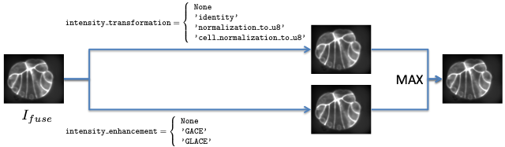

.. _cli-input-image-preprocessing:

Image preprocessing
===================

.. _fig-cli-input-image-preprocessing:

   How to build segmentation input

   The input for segmentation (ie :math:`h`-minima computation, seeded
   watershed) is built from (eventually) two images derived from the
   fusion image.

The segmentation of membranes images is based on a seeded
watershed. Seeds are computed from either one single regional minima
image (segmentation of the first time point, see section :ref:`cli-mars`)
or several ones (segmentation by propagation of the
other time points, see section :ref:`cli-astec-astec`). 

The regional minima operation, as well as the watershed operation, are conducted on the pre-processed version of the fused image. More precisely, the fused image may undergo two kinds of pre-processing, one denoted ``intensity_transformation`` (and transform the image values based on its histogram) and the other ``intensity_enhancement`` (and transform the image based on a membrane dedicated process). The image used for segmentation is the fusion (by the maximum) of these two pre-processing results (see figure :ref:`fig-cli-input-image-preprocessing`).

If the fused image is transformed before being segmented, the
transformed image is named ``<EN>_fuse_t<timepoint>_membrane.inr`` and
stored in the directory ``SEG/SEG_<EXP_SEG>/RECONSTRUCTION/`` if the
value of the variable ``keep_reconstruction`` is set to ``True``. 

Note that specifying 

.. code-block:: python
		
  intensity_transformation = 'identity'
  intensity_enhancement = None

in the parameter file comes to use the unprocessed fused image as input image for the segmentation.

.. _cli-input-image-preprocessing-histogram:

Histogram based image value transformation
------------------------------------------

The option ``intensity_transformation`` can be set to one out the three (segmentation of the first time point, see section :ref:`cli-mars`) or four (segmentation by propagation of the other time points, see section :ref:`cli-astec-astec`) values.

``None``
  this pre-processing channel is not used, meaning that only the membrane dedicated process will produce the input for the segmentation.

``'identity'``
  there is no transformation of the fused image.
  
``'normalization_to_u8'``
  input images are usually encoded on 2 bytes. However, it is of some
  interest to have input images of similar intensity distribution, so
  the segmentation parameters (eg the :math:`h` for the regional
  minima computation) do not have to be tuned independently for each
  image or sequence. 

  This choice casts the input image on a one-byte image (ie into the
  value range :math:`[0, 255]`) by linearly mapping the fused image
  values from :math:`[I_{min}, I_{max}]` to :math:`[0,
  255]`. :math:`I_{min}` and :math:`I_{max}` correspond respectively to
  the 1% and to the 99% percentiles of the fused image cumulative
  histogram. This allows to perform a robust normalization into:math:`[0, 255]`
  without being affected by extremely low or high intensity values.
  Values below :math:`I_{min}` are set to :math:`0` while values above
  :math:`I_{max}` are set to :math:`255`. 

  The percentiles used for the casting can be tuned by the means of two variables

  .. code-block:: python
		
    normalization_min_percentile = 0.01
    normalization_max_percentile = 0.99

``'cell_normalization_to_u8'``
  this choice can only be used for the segmentation propagation (see
  section :ref:`cli-astec-astec`). It has been developed (and kept)
  for historical reasons but has not proven to be useful yet.  
 
  The segmentation (the image of cell labels) at time point :math:`t`,
  :math:`S^{\star}_t`, is first deformed onto the image at time
  :math:`t+1` thanks to the transformation :math:`\mathcal{T}_{t
  \leftarrow t+1}` from the image :math:`I^{t+1}_{fuse}`
  at time :math:`t+1` towards to image
  :math:`I^{t}_{fuse}` at time :math:`t` (this
  transformation is computed with the fused
  images). The deformed segmentation can be denoted
  by :math:`S^{\star}_t \circ \mathcal{T}_{t \leftarrow t+1}`.  
  According that the co-registration of the image
  :math:`I^{t+1}_{fuse}` and :math:`I^{t}_{fuse}` is successful, this
  deformed segmentation is an estimated segmentation (without
  any cell division) of :math:`I^{t+1}_{fuse}`.  

  Instead of computing one histogram for the whole image as in the
  ``'normalization_to_u8'``, and thus having one :math:`I_{min}` and
  one :math:`I_{max}` value for the whole image, histogram are here
  computed on a cell basis, and a couple :math:`(I_{min}, I_{max})` is
  computed for each label of :math:`S^{\star}_t \circ \mathcal{T}_{t
  \leftarrow t+1}`, yielding images of values :math:`I_{min}` and
  :math:`I_{max}`. Since this induces discontinuities at cell borders,
  these two images are smoothed (with a Gaussian filter of
  standard deviation ``cell_normalization_sigma`` before casting
  into :math:`[0, 255]`. 

  For each cell, different histogram can be used for the computation
  of :math:`I_{min}` and :math:`I_{max}`.

  ``cell_normalization_max_method``
    sets the *cell area* where to compute the histogram for the
    :math:`I_{max}` value, while 
  ``cell_normalization_min_method``
    sets the *cell area* where to compute the histogram for the
    :math:`I_{min}` value.
	  
  Cell areas can be defined as

  ``cell``
    all the values of :math:`I^{t+1}_{fuse}` below the aimed cell
    defined in :math:`S^{\star}_t \circ \mathcal{T}_{t \leftarrow
    t+1}` are used for the histogram computation,
    
  ``cellborder``
    only the values of :math:`I^{t+1}_{fuse}` at the aimed cell border
    defined in :math:`S^{\star}_t \circ \mathcal{T}_{t \leftarrow
    t+1}` are used for the histogram computation, and  

  ``cellinterior``
    all the value of :math:`I^{t+1}_{fuse}` in the aimed cell interior
    (the border is excluded) defined in :math:`S^{\star}_t \circ
    \mathcal{T}_{t \leftarrow t+1}` are used for the histogram
    computation. 

  Default values are

  .. code-block:: python

    cell_normalization_max_method = 'cellborder'
    cell_normalization_min_method = 'cellinterior'

  meaning that :math:`I_{max}` are computed at the cells' borders
  while :math:`I_{min}` are computed in the cells' interiors.  

.. _cli-input-image-preprocessing-membrane:

Membrane dedicated enhancement
------------------------------

The option ``intensity_transformation`` can be set to one out the two (segmentation of the first time point, see section :ref:`cli-mars`) or three (segmentation by propagation of the other time points, see section :ref:`cli-astec-astec`) values.

``None``
  this pre-processing channel is not used, meaning that only the
  histogram based image value transformation will produce the input
  for the segmentation.
  
``'GACE'``
  stands for *Global Automated Cell Extractor*. This is the method
  described in :cite:p:`michelin:hal-00915000`,
  :cite:p:`michelin:tel-01451608`.
	
``'GLACE'``
  stands for *Grouped Local Automated Cell Extractor*. It differs from
  one step from ``GACE``: the threshold of extrema image is not
  computed globally (as in ``GACE``), but one threshold is computed
  per cell of :math:`S^{\star}_{t-1} \circ \mathcal{T}_{t-1 \leftarrow
  t}`, from the extrema values of the cell bounding box. 

``GACE`` and ``GLACE`` consist both of the following steps.

1. Membrane dedicated response computation. The Hessian is computed by
   convolution with the second derivatives of a Gaussian kernel (whose
   standard  deviation is given by ``mars_sigma_membrane``). The
   analysis of eigenvalues and vectors of the Hessian matrix allows to
   recognize the normal direction of an eventual membrane. A response
   is then computed based on a contour detector in the membrane normal
   direction. 

2. Directional extrema extraction. Extrema of the response in the
   direction of the membrane normal are extracted. It yields a valued
   image of membrane centerplanes. 

3. Direction dependent automated thresholding.

  It has been observed that the membrane contrast depends on the
  membrane orientation with respect to the microscope
  apparatus. Directional response histogram are built and a threshold
  is computed for each of them, which allows to compute a
  direction-dependent threshold.  

  Thresholds are computing by fitting known distribution on
  histograms. Fitting is done by the means of an iterative
  minimization, after an automated initialization. The
  `1sensitivity`` option allows to control the threshold choice
  after the distribution fitting. 

  Setting the ``manual`` parameter to ``True`` allows to manually
  initialize the distribution before minimization thanks to the
  ``manual_sigma`` option. 

  Last, the user can directly give the threshold to be applied (this
  is then a global threshold that did not depend on the membrane
  direction) by setting the ``hard_thresholding`` option at
  ``True``: the threshold to be applied has to set at the
  ``hard_threshold`` option. 

4. Sampling. Points issued from the previous binarization step will be
   further used for a tensor voting procedure. To decrease the
   computational cost, only a fraction of the binary membrane may be
   retained. This fractions is set by the ``sample`` option.

   .. note::
      Sampling is performed through pseudo-random numbers. To
      reproduce a  segmentation experiment by either ``GACE`` or
      ``GLACE``, the random seed can be set thanks to the
      ``mars_sample_random_seed`` option. 

      If one want to reproduce segmentation experiments, the
      verboseness of the experiments has to be increased by adding at
      least one ``-v`` in the command line of either ``astec_mars`` ot
      ``astec_astec``. This ensures that the necessary information
      will be written into the ``.log`` file. Then, to reproduce one
      given experiment, one has to retrieve the used random seed
      ``'RRRRRRRRRR'`` from the line

      .. code-block:: none

         Sampling step : random seed = RRRRRRRRRR

      in the log file
      ``SEG/SEG_<EXP_SEG>/LOGS/astec_mars-XXXX-XX-XX-XX-XX-XX.log`` or
      ``SEG/SEG_<EXP_SEG>/LOGS/astec_astec-XXXX-XX-XX-XX-XX-XX.log``,
      and then to add the line

      .. code-block:: none

         sample_random_seed = 'RRRRRRRRRR'

      in the parameter file to get the same sampling.

5. Tensor voting. Each retained point of the binary image (together
   with its membrane normal direction) generates a tensor voting
   field, whose extent is controlled by the ``sigma_TV`` option
   (expressed in voxel units). These fields are added to yield a
   global tensor image, and a membraness value is computed at each
   point, resulting in a scalar image. 

6. Smoothing. An eventual last smoothing of this scalar image may be
   done, controlled by the ``sigma_LF`` option.  

Parameter list
--------------

General parameters governing the segmentation pre-processing:

* ``intensity_prenormalization``
* ``intensity_enhancement``
* ``keep_reconstruction``
* ``intensity_transformation``

Parameters for the histogram based image value transformation:

* ``prenormalization_max_percentile``
* ``prenormalization_min_percentile``
* ``cell_normalization_max_method``
* ``cell_normalization_min_method``
* ``normalization_max_percentile``
* ``normalization_min_percentile``
* ``cell_normalization_sigma``

Parameters for the membrane dedicated enhancement:

* ``hard_threshold``
* ``hard_thresholding``
* ``manual``
* ``manual_sigma``
* ``sample``:
  this parameter sets the fraction of the binary centerplanes that
  will be used for tensor voting. Points being randomly drawn, results
  are not strictly reproducible if the code is re-run with the same
  sets of parameters. Using a larger value (smaller than or equal to
  1.0) increases the reproductibility but induces a larger
  computational cost. 
* ``sample_random_seed``:
  allows to set the random seed for reproductibility of the sampling step
* ``sensitivity``:
  this parameter sets the sensitivity for the centerplanes
  thresholding. It is set to 0.99 by default. Using larger value
  (smaller than or equal to 1.0, say 0.9999) allows to extract
  less-contrasted membranes (for instance cell/background membranes). 
* ``sigma_LF``:
  expressed in real units
* ``sigma_TV``:
  expressed in voxel units
* ``sigma_membrane``:
  expressed in real units
  
